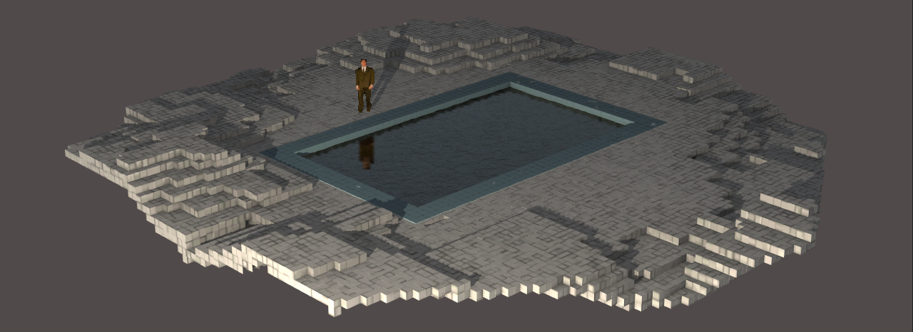

# *Game Studies*

## [Play Online](https://www.pippinbarr.com/game-studies/webgl) (desktop)

## Description
*"Step into my magic circle!" Said the designer to the player! "There will be flow states! And narrative! And no ludology! Or no narrative and a lot of ludology! Whatever you prefer! It will be ergodic if not erotic! And it will be so immersive you just might drown in it!""*

_Game Studies_ was created in [Unity](http://www.unity3d.com) with [Jonathan Lessard](http://www.jonathanlessard.net/). Sounds are all CC0 from [freesound.org](http://www.freesound.org) except for [&#8220;Firework &#8211; take off &#8211; small pop&#8221; by Quistard](https://freesound.org/people/Quistard/sounds/237753/). _Game Studies_ stars sprites of Brendon Massey in his role as John Carey in _[Police Quest: Open Season](https://en.wikipedia.org/wiki/Police_Quest:_Open_Season)_.

If you want to, you can [play the identical build of the game over on Jonathan's website](http://jonathanlessard.net/GameStudies/) as well.

## Documentation
* Read the [Process Documentation](../process)
* Unfortunately the code repository for this one isn't open source as it's a collaboration.

## Press
Read the [Press Kit](../press) for press information

* [Oujivipo](http://oujevipo.fr/general/5438-game-studies/)
* [Kill Screen](https://killscreen.com/articles/new-videogame-asks-really-need-academics-study-videogames/)
* [piqd](https://www.piqd.de/games/game-studies-ein-kurzes-spiel-uber-den-magic-circle-die-flow-theory-und-noch-einiges-mehr) (in German)
* [Robert What](https://robertwhat.com/2016/07/09/new-videogame-asks-if-games-are-needed-to-parody-academia/)
* [Rock, Paper, Shotgun](https://www.rockpapershotgun.com/2016/07/16/free-loaders-no-trash-left-behind-in-breach-clean/).
