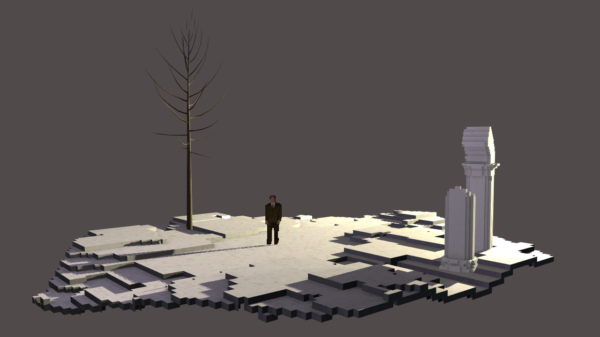
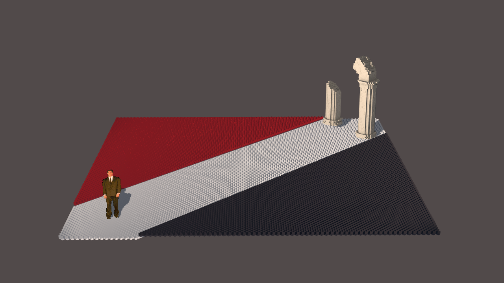
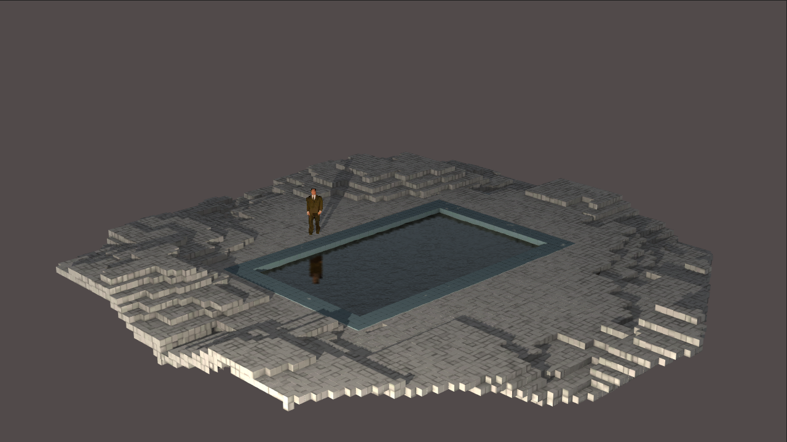
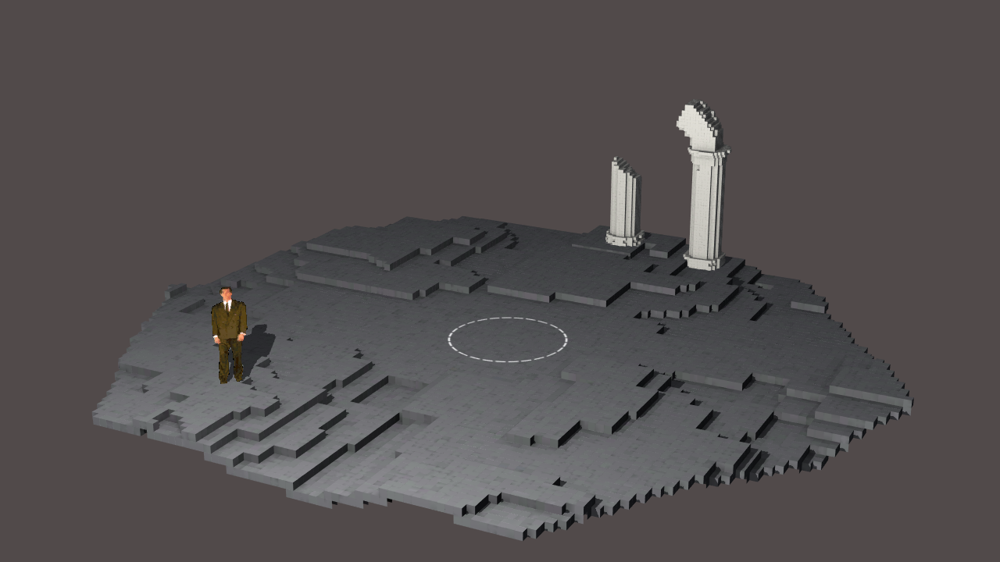
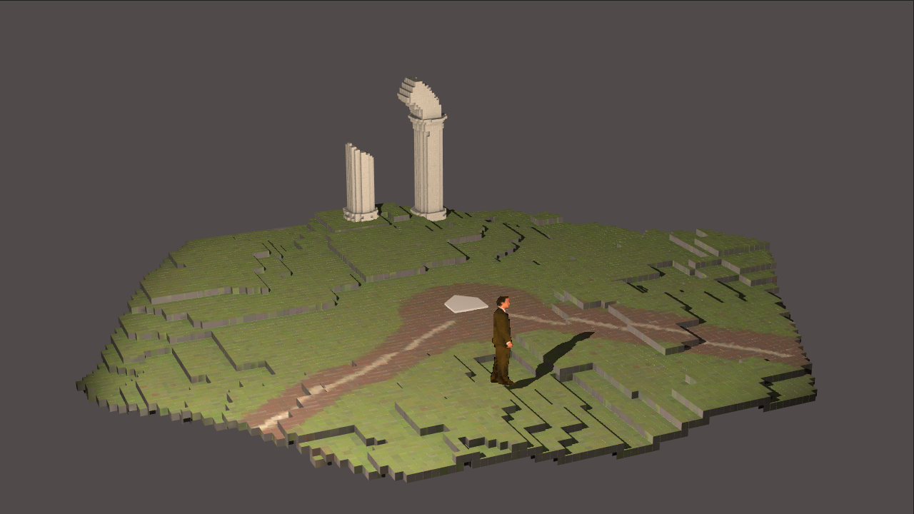

# *Game Studies*

## Information
* Released: 4 July, 2016
* Website: http://www.pippinbarr.com/
* Platforms: Browser
* Link: http://www.pippinbarr.com/game-studies/info
* Price: Free.

## Description
"Step into my magic circle!" Said the designer to the player! "There will be
flow states! And narrative! And no ludology! Or no narrative and a lot of
ludology! Whatever you prefer! It will be ergodic if not erotic! And it will be
so immersive you just might drown in it!"

## History
Game Studies is the first collaboration between Jonathan Lessard and Pippin Barr, made as a way to "teach" the academic study of games to a broad audience of game players and others. While the academics sit in their ivory towers thinking about postmodernism, Game Studies will be out there in the trenches, educating the public on the theory of games through the most painfully obvious physical metaphors for game studies concepts we could come up with.

More seriously, a central motivation behind Game Studies was to explore the popular concept that games can be used as educational tools, turning difficult abstract ideas into interactive, aesthetically-appealing presentations that are fun to play with. And what better area of abstraction to explain with a videogame than the academic study of videogames themselves?

Thus, Game Studies takes on a Big Five of game studies concepts (and authors): the Magic Circle (Johann Huizinga), Flow Theory (Mihaly Csikszentmihalyi), the infamous Ludology vs. Narratology debate (Markku Eskelinen), Ergodic Literature (Espen Aarseth), and Immersion (Janet Murray). The game is a lighthearted presentation of those theories in "game form". You might even learn something. But probably not?

## Features
* A magic circle!
* Flow states!
* Narrative! But certainly not ludology! Or is it the other way around?!
* Ergodicity!
* Total immersion!
* Brandon Massey!

## Images

## Trailer
[View the trailer on YouTube](https://youtube.com/watch?v=DgoHhm6WyNc)

## Links
* [Game Studies](http://www.gamestudies.org): Would you like to know more? There is an actual academic journal called Game Studies you can read.
* [Espen Aarseth](http://game.itu.dk/index.php/Espen_Aarseth), IT University of Copenhagen
* [Mihaly Csikszentmihalyi](https://www.cgu.edu/pages/4751.asp), Claremont Graduate University
* [Markku Eskelninen](https://fi.wikipedia.org/wiki/Markku_Eskelinen), Independent scholar
* [Johan Huizinga](https://en.wikipedia.org/wiki/Johan_Huizinga), 1872–1945
* [Brandon Massey](http://www.imdb.com/name/nm1083018), videogame character
* [Janet Murray](http://homes.lmc.gatech.edu/~murray), Georgia Tech

## Credits
* Pippin Barr: Everything
* Jonathan Lessard: Everything
* Brandon Massey: Walking and falling
