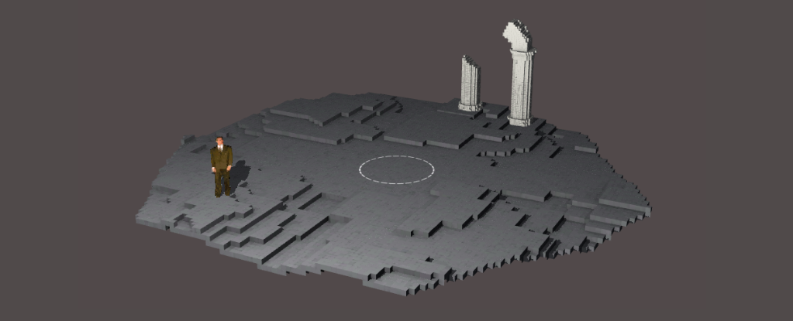

# Blog Posts

Here are public-facing blog posts I wrote while creating the game.

## Not So New Anymore New Project: Game Studies (2016-05-31)

Why hello. This is a rather brief post just to point out that at the same time as working on _v r 2_, I&#8217;ve also been working on a game called _Game Studies_ with my colleague in the department of [Design and Computation Arts](https://www.concordia.ca/finearts/design.html) and [TAG](http://tag.hexagram.ca) at Concordia University [Jonathan Lessard](http://www.concordia.ca/faculty/jonathan-lessard.html). _Game Studies_ is our valiant attempt to provide you with all the insight you&#8217;ll ever need into the dynamic academic world of&#8230; [game studies](http://www.gamestudies.org/).

Coming soon?
